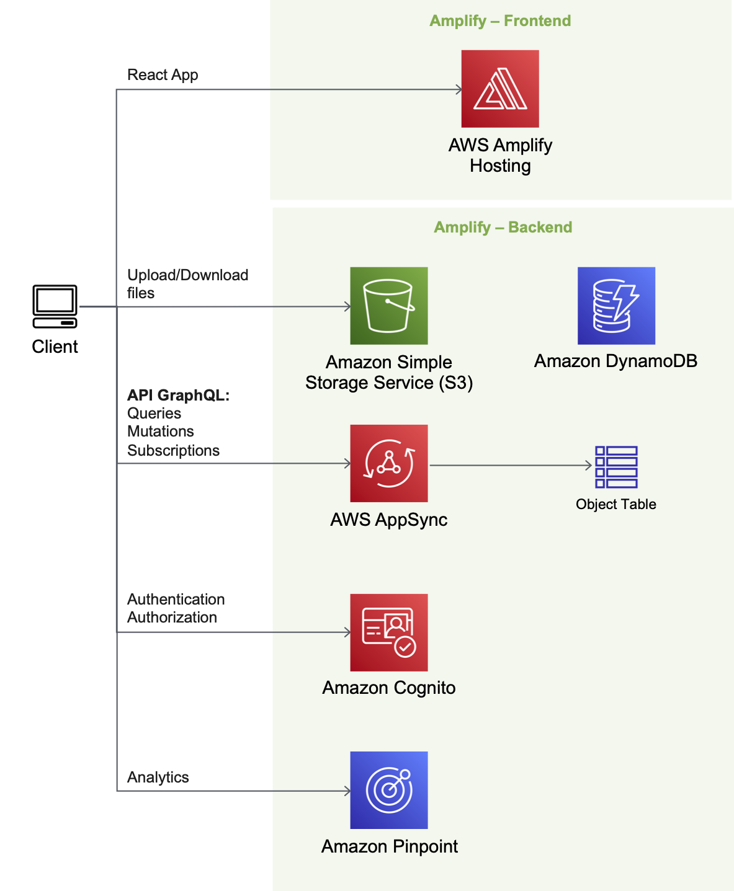

# Amplify - My Amazon S3 Drive

**High level infrastructure architecture**

## Stack

Summary of what the stack looks like:

* **Front-end** - React as the core framework, Amplify for Auth UI component and AWS integration.
* **Data** - All data is modeled after GraphQL types and stored in DynamoDB.
* **Storage** - The files are stored in Amazon S3 using the Amplify libraries.
* **API** - GraphQL is managed by AppSync and also acts as an API Hub to interact with other services.
* **Auth** - Cognito provides JSON Web Tokens (JWT) and along with AppSync fine-grained authorization on what data types users can access.
* **Analytics** - Amazon Pinpoint allows to collect analytics data from React application.

## Deployment

To get started with the **My Amazon S3 Drive** sample application, you can deploy into your AWS Account using the following button.

